## Dashboard

### Main project

### Tools for the tool builder

## Socials

Profile image via [diffuse-the-rest](https://huggingface.co/spaces/huggingface-projects/diffuse-the-rest)

<!--
### Hi there 👋

**SteveGilham/SteveGilham** is a ✨ _special_ ✨ repository because its `README.md` (this file) appears on your GitHub profile.

Here are some ideas to get you started:

- 🔭 I’m currently working on ...
- 🌱 I’m currently learning ...
- 👯 I’m looking to collaborate on ...
- 🤔 I’m looking for help with ...
- 💬 Ask me about ...
- 📫 How to reach me: ...
- 😄 Pronouns: ...
- ⚡ Fun fact: ...
-->
